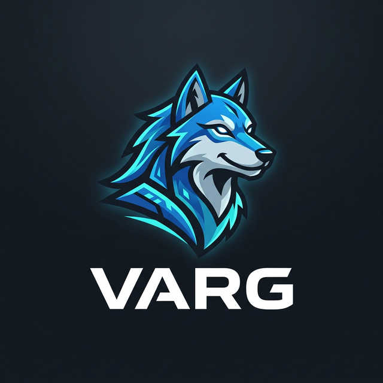

# Varg

<div align="center">
  
</div>

**Eine kompilierte Programmiersprache fuer autonome KI-Agenten.**

Varg transpiliert nach Rust und liefert native Performance mit einer entwicklerfreundlichen C#-aehnlichen Syntax.
Von Grund auf fuer autonome Agenten konzipiert -- mit eingebauter Capability-basierter Sicherheit (OCAP), Actor-Model-Concurrency und nativen KI/LLM-Typen.

```
Varg Source (.varg) --> vargc --> Rust Source --> cargo build --> Native Binary
```

---

## Auf einen Blick

| Metrik | Wert |
|--------|------|
| Compiler-Codebase | 22.682 Zeilen Rust |
| Testsuite | 577 Tests, 0 Fehler |
| Crates | 10 spezialisierte Compiler-Crates |
| Token-Typen | 119 Lexer-Tokens |
| AST-Varianten | 25 Statements, 28 Expressions |
| Builtins | 77 TypeChecker-Handler, 99 CodeGen-Handler |
| Sicherheit | 5 OCAP-Capability-Typen |
| Runtime-Module | 6 (Crypto, DB, LLM, Net, Vector, Core) |
| Entwicklungswellen | 16 abgeschlossene Wellen |

---

## Schnellbeispiel

```csharp
agent WeatherBot {
    public async string GetForecast(string city, NetworkAccess net) {
        var resp = fetch($"https://api.weather.com/{city}", "GET")?;
        var json = json_parse(resp)?;
        var temp = json_get(json, "/main/temp");
        return $"Es sind {temp} Grad in {city}";
    }

    public void Run() {
        unsafe {
            var net = NetworkAccess {};
            var forecast = self.GetForecast("Berlin", net);
            print forecast;
        }
    }
}
```

```bash
vargc run weather.varg
```

---

## Warum Varg?

| Feature | Varg | Python | TypeScript | Rust |
|---------|:----:|:------:|:----------:|:----:|
| Native Binary | Ja | - | - | Ja |
| Agent-First Design | Ja | - | - | - |
| Compile-Time Security (OCAP) | Ja | - | - | - |
| Actor Model eingebaut | Ja | - | - | - |
| LLM/KI-Typen nativ | Ja | - | - | - |
| Zugaengliche Syntax | Ja | Ja | Ja | - |
| Retry/Fallback-Syntax | Ja | - | - | - |
| Prompt als Typ | Ja | - | - | - |

---

## Sprach-Features

### Kern-Sprache
- **C#-meets-Rust-Syntax** -- vertraut fuer die meisten Entwickler
- **Agents & Actors** -- erstklassiges `agent`-Keyword mit Lifecycle (`on_start`, `on_stop`, `on_message`), State-Management und Message-Passing (`spawn`, `send`, `request`)
- **OCAP-Sicherheit** -- 5 Capability-Token-Typen, zur Compile-Zeit erzwungen
- **Contracts** -- Interface-First-Design mit Compile-Time-Enforcement
- **Generics** -- vollstaendige generische Structs, Funktionen und Trait Bounds (`<T: Display>`)
- **Enums + Pattern Matching** -- exhaustives `match` mit Guards und Wildcard
- **Closures & Lambdas** -- `(x) => x * 2` mit Typinferenz
- **Async/Await** -- basierend auf tokio Runtime
- **Error Handling** -- `Result<T, E>`, `?`-Operator, `try/catch`, `or`-Fallback
- **Pipe-Operator** -- `data |> transform |> send`
- **String-Interpolation** -- `$"Hallo {name}, du hast {count} Eintraege"`
- **Multiline Strings** -- `"""..."""` fuer Prompts und Templates
- **Iterator-Chains** -- `.filter().map().find().any().all().sort()`
- **Tuples, Ranges, HashSet** -- `(int, string)`, `0..10`, `set<T>`
- **Modulsystem** -- `import math.{sqrt, abs}`
- **Standalone-Funktionen** -- Top-Level `fn`-Definitionen ausserhalb von Agents
- **Type-Aliase** -- `type Score = int`

### KI/Agent-spezifisch
- **Retry/Fallback** -- `retry(3, backoff: 1000) { api_call() } fallback { cached_result() }`
- **Agent Lifecycle** -- `on_start`, `on_stop`, `on_message` Hooks
- **Agent Messaging** -- `spawn`, `send`, `request` fuer Actor-Model-Kommunikation
- **Prompt-Templates** -- erstklassiges `prompt`-Keyword
- **MCP-Schema-Generierung** -- `@[McpTool]`-Annotation erzeugt automatisch Tool-Schemas
- **Impliziter Kontext** -- `@[WithContext]` fuer automatische Kontext-Propagation
- **Typisierte Tool-Antworten** -- `@[ToolResponse]` fuer strukturierte LLM-Ausgaben
- **LLM-Provider-Abstraktion** -- OpenAI, Anthropic, Ollama mit einheitlicher API

### Standardbibliothek (77+ Builtins)
- **Strings** -- `split`, `contains`, `starts_with`, `ends_with`, `replace`, `trim`, `to_upper`, `to_lower`, `substring`, `index_of`, `pad_left`, `pad_right`, `chars`, `reverse`, `repeat`
- **Collections** -- `push`, `pop`, `len`, `filter`, `map`, `find`, `any`, `all`, `sort`, `contains`, `remove`, `keys`, `values`
- **Datei-I/O** -- `fs_read`, `fs_write`, `fs_append`, `fs_read_lines`, `fs_read_dir`
- **HTTP** -- `fetch` (GET/POST/PUT/DELETE), `http_request` (mit Status, Headers)
- **JSON** -- `json_parse`, `json_get`, `json_get_int`, `json_get_bool`, `json_get_array`, `json_stringify`
- **Shell** -- `exec`, `exec_status`
- **Datum/Zeit** -- `time_millis`, `time_format`, `time_parse`, `time_add`, `time_diff`
- **Regex** -- `regex_match`, `regex_find_all`, `regex_replace`
- **Kryptographie** -- `encrypt`, `decrypt`
- **Logging** -- `log_debug`, `log_info`, `log_warn`, `log_error`
- **Mathematik** -- `abs`, `sqrt`, `floor`, `ceil`, `round`, `min`, `max`, `pow`, `parse_int`, `parse_float`
- **Umgebung** -- `env("KEY")` fuer Umgebungsvariablen

### Tooling
- **VS Code Extension** -- Syntax-Highlighting fuer `.varg`-Dateien
- **Language Server (LSP)** -- Echtzeit-Diagnosen, Hover-Info, Autovervollstaendigung
- **Debug-Modus** -- `vargc build --debug` fuer schnelle Iteration (ueberspringt cargo)
- **Source Maps** -- Fehlermeldungen referenzieren Varg-Zeilennummern, nicht Rust
- **Test-Framework** -- `@[Test]`-Annotation + `assert` / `assert_eq`

---

## OCAP-Sicherheitsmodell

Jede privilegierte Operation erfordert ein Capability-Token als Methodenparameter.
Tokens koennen nur innerhalb von `unsafe`-Bloecken erzeugt werden -- der Compiler erzwingt dies zur Compile-Zeit.

```csharp
agent SecureAgent {
    // Deklariert: Diese Methode braucht Dateisystem-Zugriff
    public string ReadConfig(string path, FileAccess cap) {
        return fs_read(path)?;
    }

    public void Run() {
        // Aufrufer muss die Capability explizit gewaehren
        unsafe {
            var cap = FileAccess {};
            var config = self.ReadConfig("config.toml", cap);
            print config;
        }
    }
}
```

**5 Capability-Typen:**

| Capability | Schuetzt |
|------------|----------|
| `FileAccess` | Dateisystem-Lesen/Schreiben/Anhaengen |
| `NetworkAccess` | HTTP-Anfragen, Fetch |
| `DbAccess` | SurrealDB-Abfragen |
| `LlmAccess` | LLM-Provider-Aufrufe |
| `SystemAccess` | Shell-Kommando-Ausfuehrung |

---

## Erste Schritte

### Voraussetzungen

- [Rust](https://rustup.rs/) (1.75+)

### Compiler bauen

```bash
cd varg-compiler
cargo build --release
```

Die Compiler-Binary liegt dann unter `target/release/vargc`.

### Kompilieren & Ausfuehren

```bash
# .varg-Datei zu Native Binary kompilieren
vargc build hello.varg

# Kompilieren und sofort ausfuehren
vargc run hello.varg

# Generierten Rust-Code ausgeben (zur Inspektion)
vargc emit-rs hello.varg

# Tests mit @[Test]-Annotation ausfuehren
vargc test my_tests.varg

# Watch-Modus (bei Datei-Aenderung neu kompilieren)
vargc watch hello.varg
```

### Hello World

```csharp
// hello.varg
agent Hello {
    public void Run() {
        print "Hallo aus Varg!";
    }
}
```

```bash
vargc run hello.varg
# --> Hallo aus Varg!
```

---

## Beispiele

Siehe das [`examples/`](examples/)-Verzeichnis:

| Datei | Was es zeigt |
|-------|--------------|
| [`hello.varg`](examples/hello.varg) | Minimales Hello World |
| [`file_processor.varg`](examples/file_processor.varg) | Datei-I/O mit OCAP-Sicherheit, try/catch, Verzeichnis-Scan |
| [`api_client.varg`](examples/api_client.varg) | HTTP-Anfragen mit Retry/Fallback und JSON-Parsing |
| [`data_pipeline.varg`](examples/data_pipeline.varg) | Iteratoren, Enums, Maps, Sets, Pattern Matching |
| [`chat_agent.varg`](examples/chat_agent.varg) | Multi-Agent-System mit spawn, send, on_message |

---

## Compiler-Architektur

```
varg-compiler/crates/             22.682 LOC gesamt
  varg-ast/          683 LOC      Token-Definitionen (119 Typen, Logos) + AST (25 Stmt, 28 Expr)
  varg-lexer/        403 LOC      Tokenisierung (29 Tests)
  varg-parser/     5.965 LOC      Recursive-Descent-Parser (164 Tests)
  varg-typechecker/6.398 LOC      Semantische Analyse + OCAP-Enforcement (190 Tests)
  varg-codegen/    5.775 LOC      AST -> Rust-Code-Generierung (193 Tests)
  vargc/           1.962 LOC      CLI-Treiber (build/run/emit-rs/test/watch)
  varg-os-types/      91 LOC      Native Typen: Prompt, Context, Tensor, Embedding
  varg-runtime/      749 LOC      Runtime-Bibliothek (Crypto, Net, DB, LLM, Vector)
  varg-lsp/          641 LOC      Language Server Protocol (Diagnosen, Hover, Completion)
  varg-playground/    15 LOC      Ausfuehrungs-Sandbox
```

### Kompilierungs-Pipeline

```
  .varg Quellcode
      |
  [1] Lexer (Logos)        -- Tokenisierung in 119 Token-Typen
      |
  [2] Parser               -- Recursive Descent -> typisierter AST
      |
  [3] TypeChecker           -- Semantische Analyse, Typinferenz, OCAP-Validierung
      |
  [4] CodeGen               -- AST -> Rust-Quellcode
      |
  [5] cargo build           -- Rust -> Native Binary
```

---

## Testsuite

577 Tests ueber 5 Kern-Crates, alle bestanden:

```bash
cd varg-compiler
cargo test --lib -p varg-ast -p varg-lexer -p varg-parser -p varg-typechecker -p varg-codegen
```

| Crate | Tests | Abdeckung |
|-------|------:|-----------|
| varg-ast | 1 | AST-Konstruktion |
| varg-lexer | 29 | Alle Token-Typen, Randfaelle |
| varg-parser | 164 | Jede Statement/Expression-Variante |
| varg-typechecker | 190 | Typinferenz, OCAP, Fehlerpfade |
| varg-codegen | 193 | End-to-End Rust-Generierung, Kompilierung |
| **Gesamt** | **577** | **0 Fehler** |

---

## Projektstruktur

```
Project X/
  VARG.md                 Projektregeln & Dokumentations-Index
  README.md               Englische Version
  README_DE.md            Diese Datei (Deutsch)
  REFERENCE.md            Vollstaendige Sprachreferenz
  docs/
    language/             5 Sprachdesign-Dokumente
    os/                   5 OS-Architektur-Dokumente
  examples/               5 Beispielprogramme
  varg-compiler/          Rust Workspace (10 Crates, 22.682 LOC)
  varg-vscode/            VS Code Extension (Syntax Highlighting)
```

---

## Status

Varg wird aktiv entwickelt. Der Compiler ist funktionsfaehig und erzeugt lauffaehige native Binaries.
16 Entwicklungswellen abgeschlossen, 577 Tests bestanden.

Die Sprache eignet sich fuer den Bau von echten Agenten, CLI-Tools, API-Clients und Automatisierungsskripten.

---

## Lizenz

MIT
